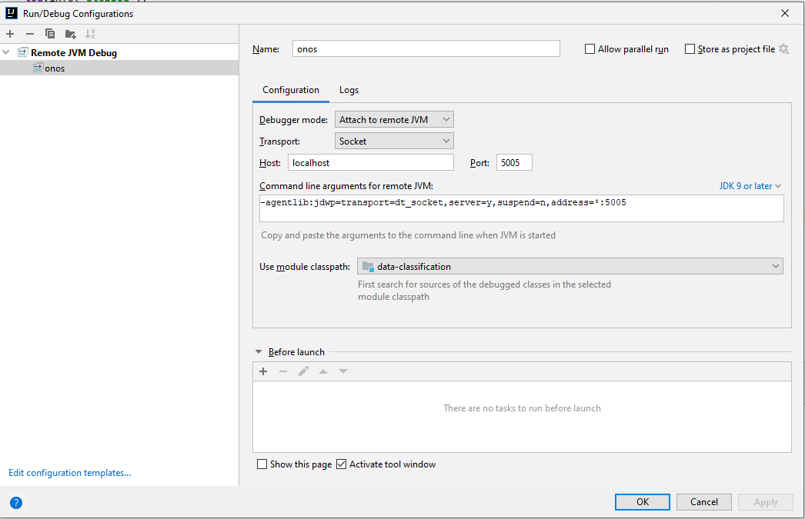

1. Chạy project
```bash
    ./run.sh
```
2. Kiến thức về mạng
- với lệnh ping sẽ truyền gói tin `icmp`
- trong docker sẽ dùng network `bridge` là mặc định
- các switch trong SDN phải hỗ trợ openflow
3. Onos
- vào ui qua đường dẫn: http://localhost:8183
    - username: onos
    - pasword: rocks
- xem version: `cat ~/onos/VERSION`
- tạo project:
    - clone project onos: `https://github.com/opennetworkinglab/onos.git`
    - chạy lệnh: `bash "<đường dẫn tới project onos>/tools/dev/bin/onos-create-app"`
        - đặt tên groupId: domain tổ chức
        - đặt tên artifactId: tên app viết thường
        - tên package: kết hợp domain tổ chức và tên app
- build:
    - build và test: `mvn clean install`
    - buid oar: 
        - trong file `pom.xml` uncomment các phần `onos.app.*` và điền thông tin phù hợp
        - chạy lại lệnh `mvn clean install`
        - sau khi chạy xong sẽ có thêm file `.oar` để cài đặt
- install app:
    - chạy lênh: `/root/onos/bin/onos-app localhost install! <tên app>.oar`
- debug:
    - mở project bằng intellij
    - thêm run/debug config:
        - chọn Remote JVM Debug
        - đăt tên cho config
        - để các cấu hình mặc định
        
    - thêm environment: `JAVA_TOOL_OPTIONS="-agentlib:jdwp=transport=dt_socket,server=y,suspend=n,address=*:5005 $JAVA_TOOL_OPTIONS"`
- cài bazel:
    - chọn phiên bản phù hợp, tìm tải file zip cho windows `windows-x86_64.zip` tại url release sau https://github.com/bazelbuild/bazel/releases
    - tải về giải nén và dẫn `PATH` vào thư mục này
- fix lỗi CRLF -> LF: 
    - với file java: `find . -name "*.java" -type f -exec dos2unix {} \;`
    - với tất cả các file: `find . -type f -exec dos2unix {} \;`
    - cấu hình git: `git config core.autocrlf false` cho local repo
- kích hoạt app:
    - cấu hình qua environment variable `ONOS_APPS`, lưu ý sẽ bị lỗi app đầu và app cuối nên để cuối cùng bằng dấu `,`
        - vd: `ONOS_APPS="drivers,hostprovider,lldpprovider,gui2,vn.edu.huce.data-classification,fwd,openflow,"`
    - `Reactive Forwarding` - `org.onosproject.fwd`: có tác dụng xử lý chuyển tiếp gói tin mạng dựa trên cơ sở phản ứng. Thay vì cấu hình trước một bảng chuyển tiếp (flow table) để xử lý gói tin, Reactive Forwarding xác định cách xử lý gói tin dựa trên sự phản ứng của mạng khi gói tin đến. Kịch hoạt ứng dụng này thì có thể ping được
    - `OpenFlow Provider Suite` - `org.onosproject.openflow`: là một tập hợp các ứng dụng cung cấp khả năng hỗ trợ giao thức OpenFlow, một giao thức quản lý mạng SDN phổ biến. Nó cho phép ONOS tương tác với các thiết bị mạng (switches và routers) hỗ trợ OpenFlow để cấu hình và điều khiển chúng.
4. mininet
- xem version: `mn --version`
- chạy thử kết nối đến onos: `mn --controller=remote,ip=192.168.0.2,port=6653 --switch=ovs,protocols=OpenFlow13`
    - sử dụng OpenFlow13 phù hợp với onos phiên bản latest